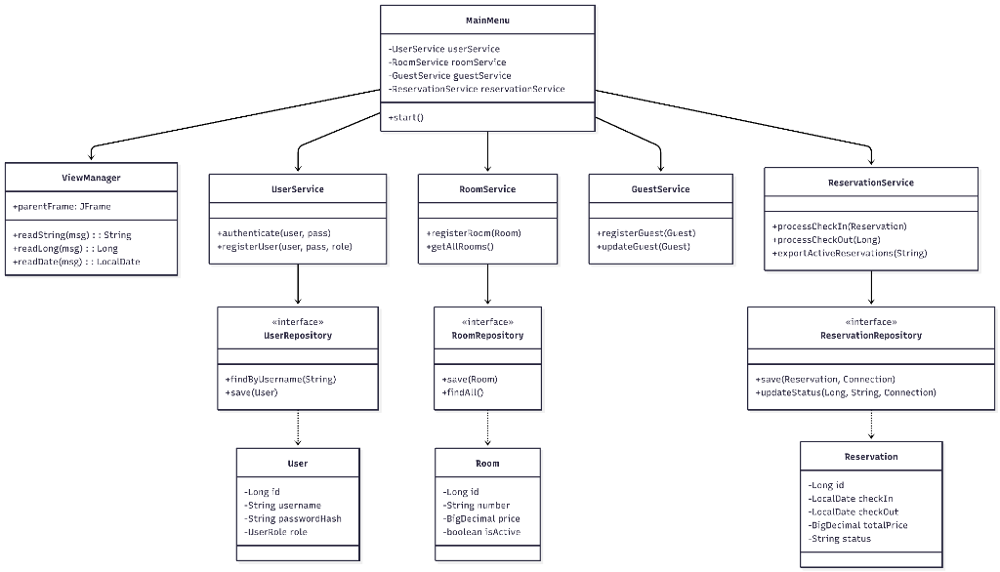
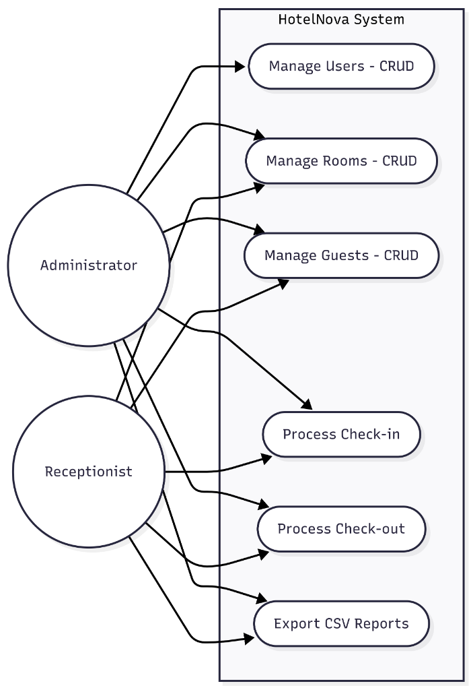

# HotelNova - Hotel Management System

## 1. General Description

HotelNova is a robust, modular, and secure Hotel Management System built with Java 17. Designed with a strict **Layered Architecture** (UI -> Service -> Repository/DAO), the application ensures clear separation of concerns, maintainability, and scalability. 

At its core, HotelNova leverages **JDBC for direct database interactions**, providing fine-grained control over **ACID transactions** to guarantee data integrity during critical operations like Check-ins and Check-outs. Security is a first-class citizen, featuring role-based access control and secure password hashing using **BCrypt**. The system also includes business-critical features such as automated CSV reporting and console-based HTTP request simulations for monitoring.

## 2. Prerequisites

To run and contribute to this project, ensure you have the following installed on your system:

| Technology | Version | Description |
| :--- | :--- | :--- |
| **Java Development Kit (JDK)** | 17 | Core programming language environment |
| **Apache Maven** | 3.8+ | Dependency management and build automation |
| **PostgreSQL (Supabase)** | 14+ | Cloud-based relational database |
| **Git** | 2.x | Version control system |

## 3. Configuration & Execution

### Environment Setup

Before running the application, you must configure the database connection. 

1. Navigate to `src/main/resources/`.
2. Open or create the `config.properties` file.
3. Add your Supabase PostgreSQL credentials and system configurations:

```properties
db.url=jdbc:postgresql://<SUPABASE_HOST>:5432/postgres
db.user=<YOUR_DB_USER>
db.password=<YOUR_DB_PASSWORD>
tax.vat=0.19
```
*Note: The `tax.vat` property defines the 19% IVA applied dynamically during Check-out calculations.*

4. **Database Schema:** To recreate the database environment from scratch, execute the `database.sql` script located at the root of this project.

### Running the Application

HotelNova is built with Maven. To clean, compile, and execute the graphical user interface (JOptionPane), run the following command in your terminal from the project root:

```bash
mvn clean compile exec:java -Dexec.mainClass="com.hotelnova.view.MainMenu"
```

### Running Tests

The project includes a suite of unit tests powered by **JUnit 5** to validate core business logic (e.g., duplicate room validation, minimum 1-night stay enforcement). To run the test suite:

```bash
mvn clean test
```

## 4. GUI & Screenshots

HotelNova features a lightweight, accessible graphical interface built using Java Swing's `JOptionPane`.

*(Placeholder for Screenshots)*
* **Main Menu:** `[Insert Screenshot Here]`
* **CRUD Forms (Rooms/Guests/Users):** `[Insert Screenshot Here]`
* **Check-out Receipt & Billing:** `[Insert Screenshot Here]`

## 5. Class Diagram

The following diagram illustrates the Layered Architecture and relationships between the UI, Services, Repositories, and Models.



## 6. Use Case Diagram

The following diagram defines the primary roles and their interactions within the system.



## 7. Technical Highlights

* **ACID Transactions:** Complex operations like Check-in and Check-out are wrapped in strict JDBC transactions (`setAutoCommit(false)`). If a reservation is successfully created but updating the room status fails, the entire transaction is rolled back, preventing orphaned data and maintaining database integrity.
* **Security & Authentication:** User passwords are never stored in plain text. HotelNova utilizes `BCrypt` for robust password hashing. Access to system modules (like User Management) is gated by role (`ADMIN` vs `RECEPTIONIST`).
* **CSV Exports:** The system features an integrated reporting module that exports active reservations directly to a `.csv` file, leveraging native graphical file choosers (`JFileChooser`) to save dynamically to the user's `Downloads` directory for improved UX.
* **Console Monitoring:** The application simulates HTTP endpoint hits (e.g., `[LOG] POST /api/rooms - Room successfully registered`) in the console, providing backend-like observability and an audit trail for system events.
* **Strict Business Rules Enforcement:** 
    * Validates unique room numbers during creation.
    * Enforces a minimum of 1-night stay dynamically using Java's `java.time` API.
    * Prevents overlapping reservations for the same room.
    * Validates that guests are `is_active` before allowing a Check-in.

## 8. Author & Developer

* **Name:** Nicolas Agudelo
* **Alias:** Hamiltol
* **Email:** [niccko1082@gmail.com](mailto:niccko1082@gmail.com)
* **ID / Document:** 1082867544
